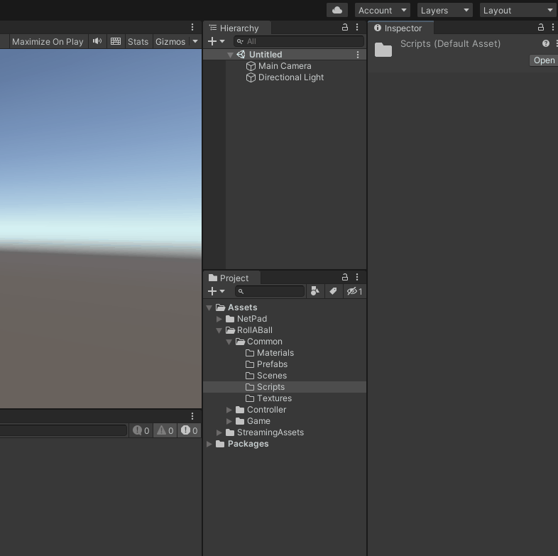

# Preperation

Some initial preparation is required.

* To create a NetPadConstantGenerator, navigate to the "Common/Scripts" folder, right-click and then select "Create/NetPad/NetPadConstantGenerator."
* Set the 'Namespace' field to "RollABall.Common".
* Add a new property by entering the name "playerColor" and selecting the 'Color' type from the dropdown menu.
* Click the 'Generate' button to initiate the code generation process, which will create a constant and extension methods for enhanced usability with player properties.

<figure><figcaption></figcaption></figure>
